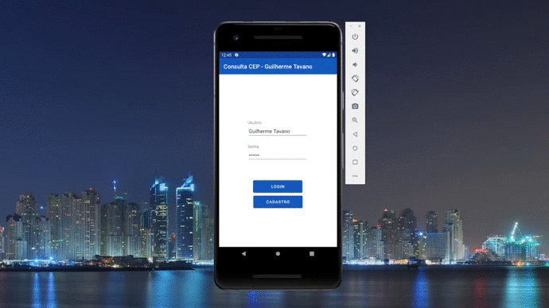

# ViaCepComKotlin
Projeto desenvolvido para o processo seletivo da www.tantto.com.br/

# Regras:

### Desenvolver um aplicativo móvel que seja compilável para Android usando Android Studio.

#### Este aplicativo deverá conter 3 telas.

##### Tela :one:: 

Tela de login, com usuário e senha. Sempre que o aplicativo for
aberto será possível entrar com último usuário e senha digitados, ou
digitar um novo usuário e senha. Para essa tela deve ser utilizado um
banco de dados local ou outra técnica de armazenamento local.

##### Tela :two:: 

Painel de controle (Dashboard), com um botão chamando a tela 3.

##### Tela :three::

a) Buscar CEP digitado e mostrar retorno da tela. Usar o seguinte
webservice para consulta http://viacep.com.br/ .

b) Ao digitar um dos CEP abaixo, o sistema não deverá fazer a busca no
webservice, e deve apresentar a seguinte mensagem:
“Este CEP está na lista negra”.
Lista: 18010-001, 18010-082, 18013-001 e 18055-131.

c) CEP do estado de MG devem retornar erro.

d) Qualquer bairro começado com “s” ou “S” também deve retornar erro.
